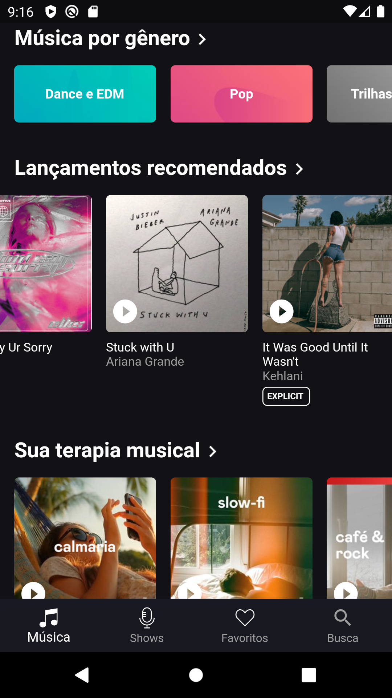
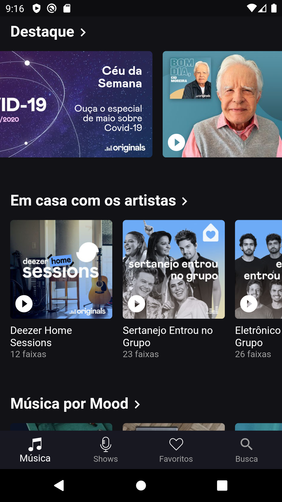
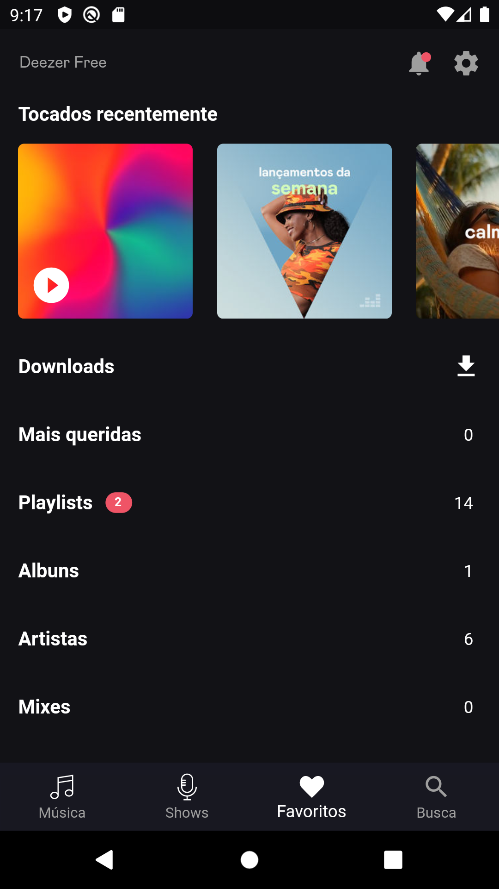
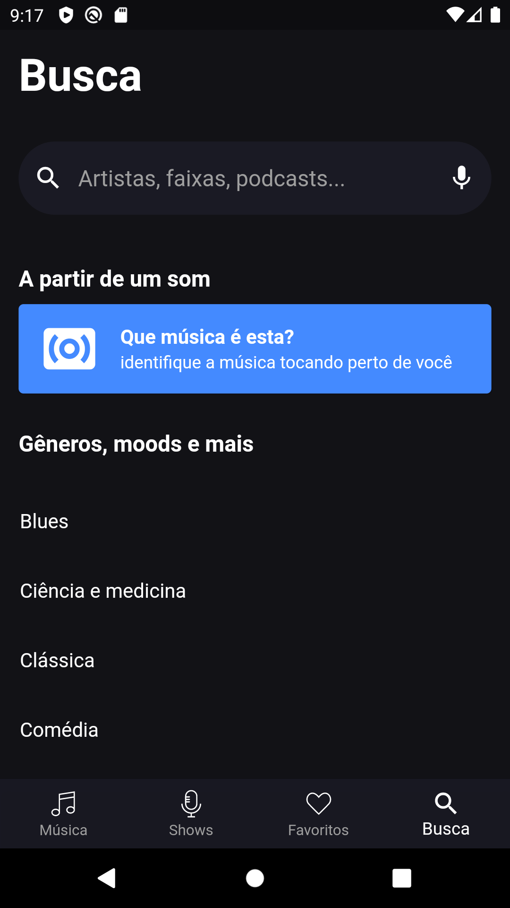
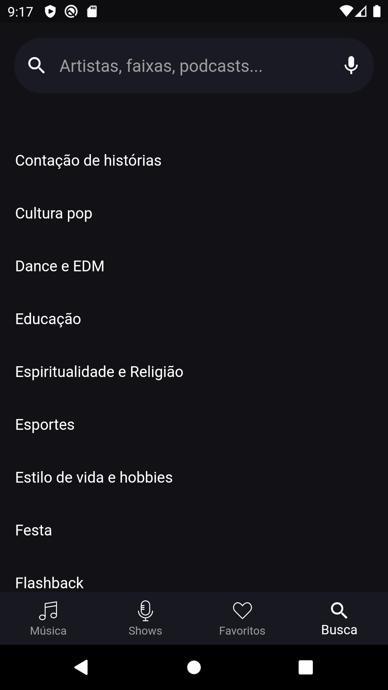

# Clone Deezer Flutter

###### Aplicativo criado para fins de aprendizagem.

### Música

  
  
  

### Shows

  
  

### Favoritos

### Busca

#### Observações sobre o projeto

Todos os dados das telas são mocks, é possível implementar a api do deezer, mas ainda não fiz isto, deixei dentro do projeto nos diretórios models e service exemplos de como tratar e fazer consultas para api deles, espero em breve finalizar está implementação.

## Getting Started

This project is a starting point for a Flutter application.

A few resources to get you started if this is your first Flutter project:

- [Lab: Write your first Flutter app](https://flutter.dev/docs/get-started/codelab)
- [Cookbook: Useful Flutter samples](https://flutter.dev/docs/cookbook)

For help getting started with Flutter, view our
[online documentation](https://flutter.dev/docs), which offers tutorials,
samples, guidance on mobile development, and a full API reference.
